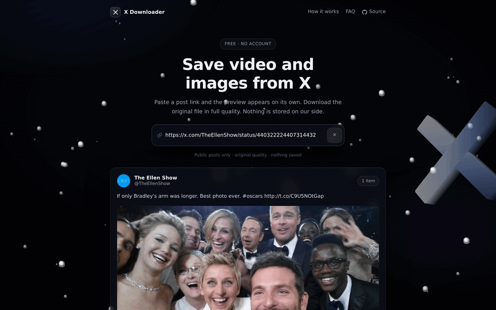
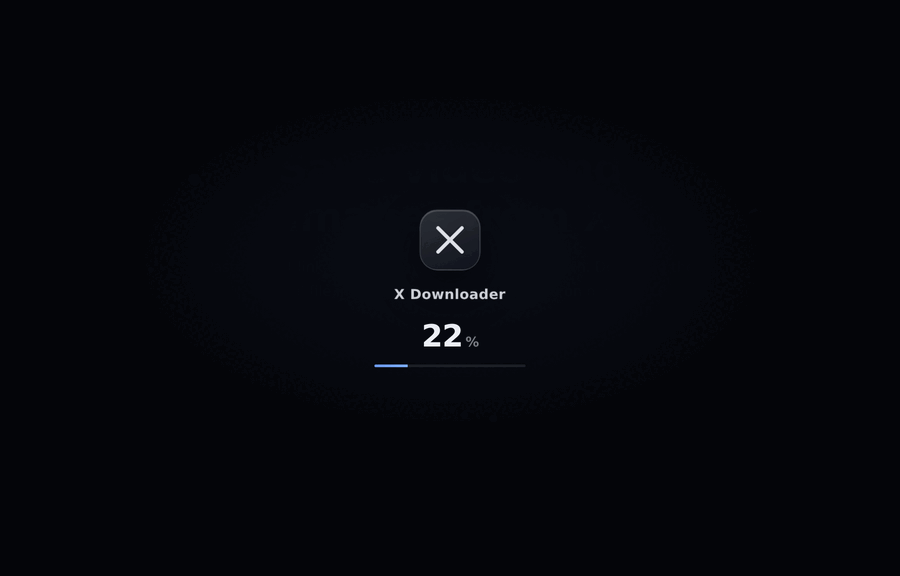
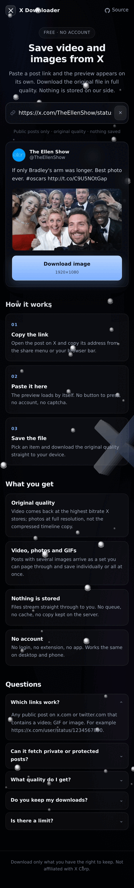
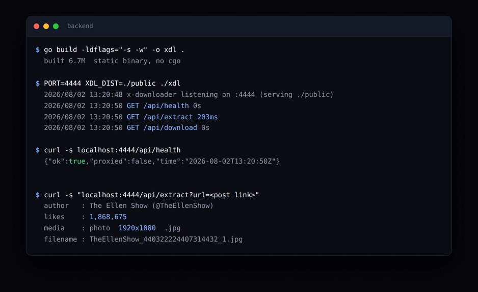

<div align="center">

# ✖️ X Downloader

**Save video and images from any public X post.**
Paste a link, the preview loads on its own, download the original file.

<br/>


[](https://xdownloaderapp.vercel.app)


</div>

<br/>

## 🖥️ The app



<div align="center">
  
  
</div>

<br/>

## ⚡ Live



<br/>

## ✨ What it does

| | |
|:--|:--|
| 🎬 **Video, photos and GIFs** | Posts with several images come back as a set you can page through |
| 💎 **Original quality** | Highest bitrate MP4 that X stores, photos at full resolution |
| 👁️ **Instant preview** | The card appears as soon as a link lands in the field, no button |
| 🔒 **Nothing kept** | Bytes stream straight through, no queue, no cache, no history |
| 📱 **Desktop and mobile** | One layout that adapts, tested at 390px and 1440px |
| 🚫 **No account** | No login, no extension, no captcha |

<br/>

## 🧭 How it works

```
  browser  ──▶  Go server  ──▶  cdn.syndication.twimg.com   (tweet JSON)
                    │
                    └────────▶  video.twimg.com / pbs.twimg.com   (media bytes)
```

Extraction uses X's public syndication endpoint, the same one the embed widget
calls, so no API key is involved. Media is streamed back through the server so
the browser receives a real filename and never talks to X directly.

<br/>

## 🚀 Run it

**Backend**

```bash
cd backend
go build -o xdl .
PORT=4445 XDL_DIST=../frontend/dist ./xdl
```

**Frontend**

```bash
cd frontend
npm install
npm run build      # production bundle into dist/
npm run dev        # or hot reload on :5173, proxying /api to the backend
```

Open `http://localhost:4445`.

<br/>

## ⚙️ Settings

| Variable | Default | Purpose |
|:--|:--|:--|
| `PORT` | `4444` | Port the server listens on |
| `XDL_DIST` | `./public` | Folder holding the built frontend |
| `XDL_PROXY` | unset | Upstream HTTP proxy, for example a local VLESS exit |

`XDL_PROXY` exists for the day X starts refusing the host's own address. Point
it at an Xray inbound and every request leaves through that exit instead.
`/api/health` reports `proxied: true` when it is active.

<br/>

## 📡 API

| Method | Route | Returns |
|:--|:--|:--|
| `GET` | `/api/health` | Service state and whether a proxy is in use |
| `GET` | `/api/extract?url=` | Post metadata plus every downloadable item |
| `GET` | `/api/download?url=&filename=` | The media, streamed as an attachment |

```bash
curl -s "http://localhost:4445/api/extract?url=https://x.com/user/status/123"
```

```json
{
  "id": "440322224407314432",
  "author": "The Ellen Show",
  "handle": "TheEllenShow",
  "likes": 1868788,
  "media": [
    {
      "type": "photo",
      "url": "https://pbs.twimg.com/media/....jpg?name=orig",
      "width": 1920,
      "height": 1080,
      "ext": "jpg",
      "filename": "TheEllenShow_440322224407314432_1.jpg"
    }
  ]
}
```

`/api/download` only accepts `twimg.com` hosts. Anything else is refused with a
403 so the route cannot be turned into an open proxy.

<br/>

## 🛠️ Built with

<div align="center">

| Layer | Choice | Why |
|:--|:--|:--|
| 🟦 Backend | **Go** | Single static binary, streams large files without buffering |
| ⚛️ Frontend | **React + TypeScript** | Small surface, strict types across the API boundary |
| ⚡ Bundler | **Vite** | Sub second builds, dev proxy straight to the Go server |
| 🎨 Backdrop | **Canvas 2D** | Sprites baked once per depth tier, blitted per frame |

</div>

<br/>

<div align="center">
<br/>
<sub>MIT licensed</sub>
</div>
